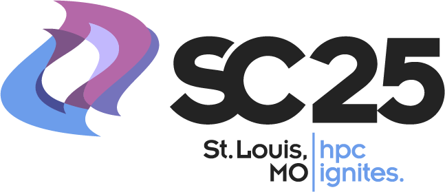

SC25 Workshop: High Performance Python for Science at Scale (HPPSS)
+++++++++++++++++++++++++++++++++++++++++++++++++++++++++++++++++++

|

**Expanding scientific discovery with High-Performance Computing through Python at scale.**

About
=====

This workshop aims to connect researchers, developers, and Python practitioners to share their experiences
scaling Python applications and codes on supercomputers. The goal is to provide a platform for topical
discussion of best practices, hands-on demonstrations, and community engagement via open-source contributions
to new libraries, runtimes, and frameworks. Based on invited talks that survey and summarize the best
practices and recent success stories, panel sessions that discuss details of implementation and live demo
sessions for hands-on enthusiasts – the workshop will serve as a requirements gathering exercise for the
future of Python in HPC and science.

St. Louis, November 16-21, 2025

.. toctree::
    :caption: Contents
    :maxdepth: 1

    About <about.rst>
    Organization <organizers.rst>
    SC23 Workshop Site <https://hppss.github.io/SC23>
    SC24 Workhsop Site <https://hppss.github.io/SC24>

Diversity and Inclusion
=======================

.. |SC25DI| raw:: html

   <a href="https://sc25.supercomputing.org/attend/code-of-conduct/" target="_blank">SC25 Code of Conduct</a>

This workshop pledges to follow the SC25 Code of Conduct. Please visit the |SC25DI|.

.. toctree::
    :maxdepth: 1
    :hidden:

    genindex
    Search <search>

