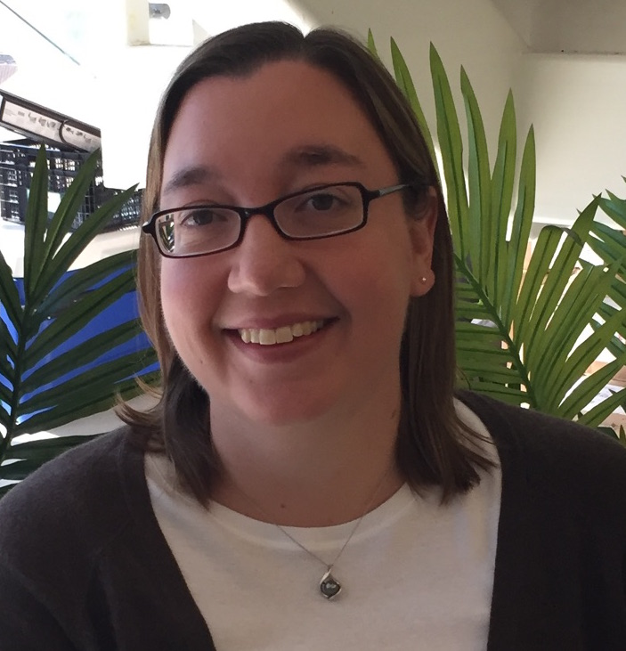
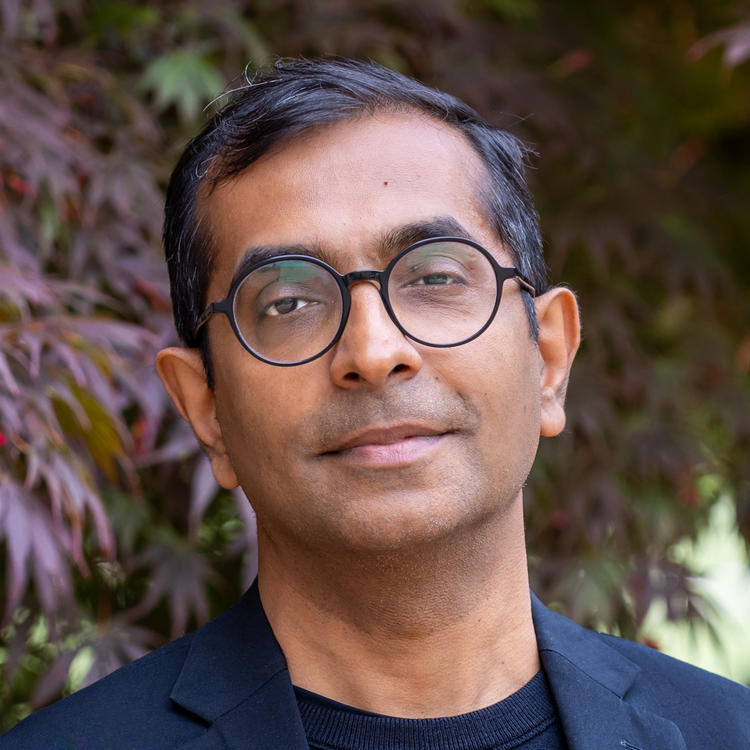
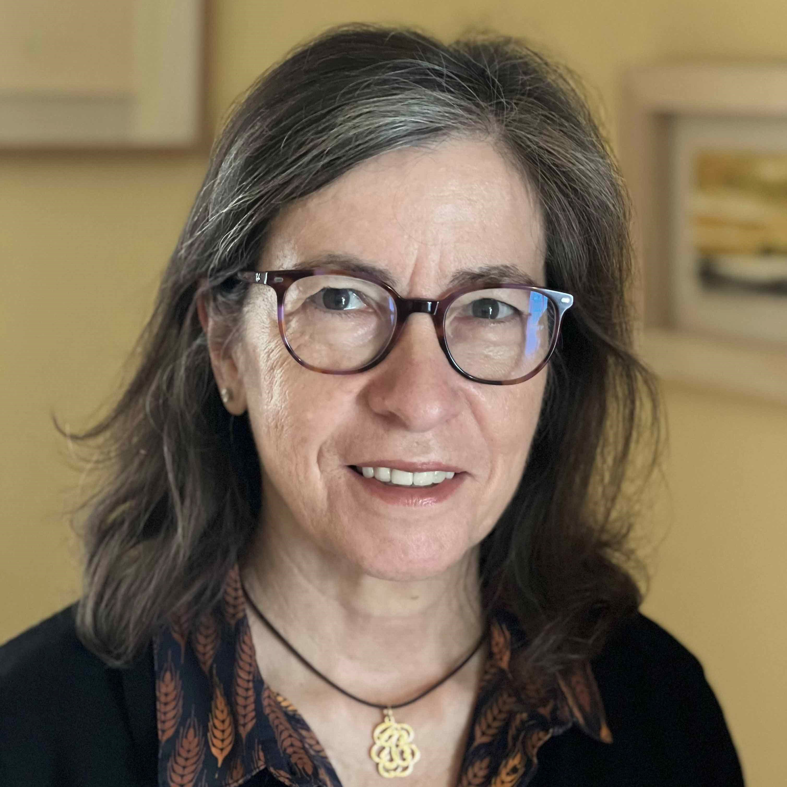
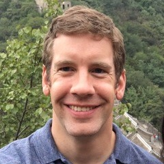
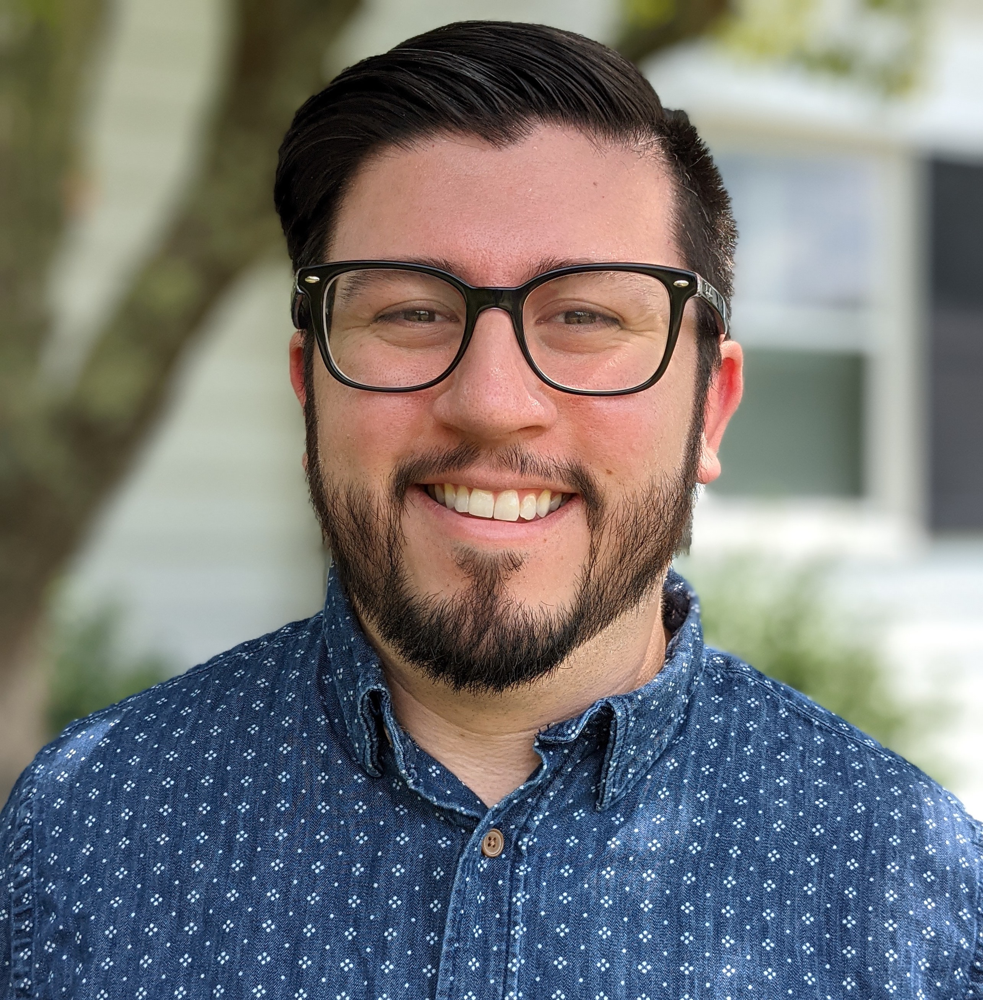
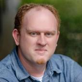

Workshop Schedule
+++++++++++++++++

.. |SC25Sched| raw:: html

   <a href="https://sc25.conference-program.com/session/?sess=sess231" target="_blank">Link to SC25 HPPSS Schedule</a>

HPPSS will take place on Monday, November 17th from 2 PM - 5:30 PM CST in room 242. See the |SC25Sched| for more details.

+-----------------------------------------------------------+-------------------------------------------------------------+---------------------+
| Event                                                     | Speaker(s)                                                  | Time                |
+===========================================================+=============================================================+=====================+
| HPPSS Introduction                                        | Pete Mendygral, Sunita Chandrasekaran, Daniel Margala,      | 2 PM - 2:10 PM      |
|                                                           |                                                             |                     |
|                                                           | Sam Foreman, Davin Potts, Andy Terrel                       |                     |
+-----------------------------------------------------------+-------------------------------------------------------------+---------------------+
| Featured Speaker                                          | Katrina Riehl                                               | 2:10 PM - 2:45 PM   |
+-----------------------------------------------------------+-------------------------------------------------------------+---------------------+
| Invited Speaker                                           | Shantenu Jha                                                | 2:45 PM - 3 PM      |
+-----------------------------------------------------------+-------------------------------------------------------------+---------------------+
| Afternoon Break                                           |                                                             | 3 PM - 3:30 PM      |
+-----------------------------------------------------------+-------------------------------------------------------------+---------------------+
| Invited Speaker                                           | Rosa M. Badia                                               | 3:30 PM - 3:45 PM   |
+-----------------------------------------------------------+-------------------------------------------------------------+---------------------+
| Up-scaling Python functions for HPC with executorlib      | Jan Janssen                                                 | 3:45 PM - 4:00 PM   |
+-----------------------------------------------------------+-------------------------------------------------------------+---------------------+
| High-Performance Python for Pixelated LArTPC Simulation:  | Madan K. Sharma Timalsina                                   | 4:00 PM - 4:15 PM   |
|                                                           |                                                             |                     |
| Scale on NERSC (Perlmutter) and TACC (Vista)              |                                                             |                     |
+-----------------------------------------------------------+-------------------------------------------------------------+---------------------+
| A first look at Mojo’s MLIR-based Performance Portable    | William Godoy                                               | 4:15 PM - 4:30 PM   |
|                                                           |                                                             |                     |
| GPU Programming for Python Users                          |                                                             |                     |
+-----------------------------------------------------------+-------------------------------------------------------------+---------------------+
| NVSHMEM4Py                                                | Benjamin Glick                                              | 4:30 PM - 4:45 PM   |
+-----------------------------------------------------------+-------------------------------------------------------------+---------------------+
| Panel Discussion: Managing a Python Environment for       | Todd Gamblin, Charlie Marsh, Michael Sandoval, Stan Siebert | 4:45 PM - 5:30 PM   |
|                                                           |                                                             |                     |
| Everyone                                                  |                                                             |                     |
+-----------------------------------------------------------+-------------------------------------------------------------+---------------------+

Katrina Riehl (Nvidia) - Featured Speaker
=========================================

Dr. Katrina Riehl is a Principal Technical Product Manager at NVIDIA leading the CUDA Education program. For over two decades, Katrina has worked 
extensively in the fields of scientific computing, machine learning, data science, and visualization. Most notably, she has helped lead data 
initiatives at the University of Texas Austin Applied Research Laboratory, Anaconda, Apple, Expedia Group, Cloudflare, and Snowflake. She is an 
active volunteer in the Python open-source scientific software community and currently serves on the Advisory Council for NumFOCUS.

|

|

Shantenu Jha (Rutgers) - Invited Speaker
========================================

Shantenu is a Professor of Computer Engineering at Rutgers University–New Brunswick and Head of Computational Sciences at the U.S. Department of 
Energy’s Princeton Plasma Physics Laboratory, while also holding a concurrent appointment as a Research Scholar at Princeton University. His 
research focuses on AI for Science using high-performance distributed computing. He is the recipient of the NSF CAREER Award (2013), the ACM 
Gordon Bell Special Prize (2020), and numerous other best papers and honors, including the IEEE SCALE 2018 Award.

|

|

Rosa M. Badia (Barcelona Supercomputing Center) - Invited Speaker
=================================================================

Rosa M. Badia holds a PhD in Computer Science (1994) from the Technical University of Catalonia (UPC). She is the director of the HPC software 
research area and the manager of the Workflows and Distributed Computing research group, both roles at the Barcelona Supercomputing Center (BSC, Spain).
Her research has contributed to parallel programming models for multicore and distributed computing. Recent contributions have focused on the 
digital continuum, proposing new programming environments and software for edge-to-cloud, as well as for the support of hybrid quantum-classic 
workflows. The research is integrated in PyCOMPSs/COMPSs, a parallel task-based programming distributed computing framework, and its application 
to developing large heterogeneous workflows that combine HPC, Big Data, and Machine Learning. The group is also doing research around the dislib, 
a parallel machine learning library parallelized with PyCOMPSs. Dr Badia has published more than 200 papers on her research topics in international 
conferences and journals. She has been very active in projects funded by the European Commission and in contracts with industry. She was the PI of 
the EuroHPC project eFlows4HPC. She is a member of the EuroHPC JU RIAG and a member of the HiPEAC Network of Excellence. She received the Euro-Par 
Achievement Award 2019, the DonaTIC award, category Academia/Researcher in 2019 and the HPDC Achievement Award 2021. Since 2023 she is a member of 
the Institut d'Estudis Catalans (Catalan academy). She is the chair of the ACM Europe Council since beginning of 2022.

Panel
=====

Todd Gamblin
------------

Todd Gamblin is a Distinguished Member of Technical Staff in the Livermore Computing division at Lawrence Livermore National Laboratory. He created Spack, a popular open source HPC package management tool with a rapidly growing community of contributors. He leads the Packaging Technologies Project in the U.S. Exascale Computing Project, LLNL's DevRAMP project on developer productivity, and BUILD, a Strategic Initiative on software integration. His research interests include dependency management, open source, software engineering, parallel computing, performance measurement, and performance analysis.

Todd has been at LLNL since 2008. He received the Early Career Research Award from the U.S. Department of Energy in 2014, an R&D 100 award in 2019, and the LLNL Director's Science & Technology Award in 2020. He received Ph.D. and M.S. degrees in Computer Science from the University of North Carolina at Chapel Hill in 2009 and 2005, and his B.A. in Computer Science and Japanese from Williams College in 2002.

|

|

Michael Sandoval
----------------

Michael earned his Bachelor of Science degree from San Jose State University in 2015, where he majored in Physics and minored in both Math and Astronomy. He then received his Physics Ph.D. in 2021 from the University of Tennessee, Knoxville where he studied the late-time evolution of core-collapse supernovae. His work involved running simulations on multiple HPC systems, including Titan and Summit, while visualizing data on Rhea and Andes using Python-based tools like VisIt and Blender.

Michael is now an HPC Engineer in the User Assistance group at the Oak Ridge Leadership Computing Facility (OLCF), with a particular interest in providing Python support for users of OLCF resources. As the quantum computing lead for User Assistance, he also manages the Quantum Computing User Program (QCUP) hubs and is helping pathfind Quantum Computing/HPC integration within OLCF.

|

|

Charlie Marsh
-------------

Charlie is the founder of Astral, where he builds high-performance developer tools for the Python ecosystem. Over the past two years, he's launched Ruff — a Python linter, formatter, and code transformation tool — and uv, a next-generation Python package and project manager. Together, these tools have grown to over one hundred million downloads per month and seen rapid adoption across open source and enterprise. Charlie received a BSc in Computer Science from Princeton University and lives in Brooklyn, NY.

|

|

|

Stan Seibert
------------

Stan leads the Community Innovation team at Anaconda, where his work focuses on high-performance GPU computing and designing data analysis, simulation, and processing pipelines. He is a longtime advocate of the use of Python and GPU computing for research. Prior to joining Anaconda, Stan served as Chief Data Scientist at Mobi, where he worked on vehicle fleet tracking and route planning.

Stan received a PhD in experimental high energy physics from the University of Texas at Austin and performed research at Los Alamos National Laboratory, University of Pennsylvania, and the Sudbury Neutrino Observatory.

Presentations
=============

Up-scaling Python functions for HPC with executorlib
----------------------------------------------------

The up-scaling of Python workflows from the execution on a local workstation to the parallel execution on an HPC typically faces three challenges: 
(1) the management of inter-process communication, (2) the data storage and (3) the management of task dependencies during the execution. These 
challenges commonly lead to a rewrite of major parts of the reference serial Python workflow to improve computational efficiency. Executorlib 
addresses these challenges by extending Python’s ProcessPoolExecutor interface to distribute Python functions on HPC systems. It interfaces with 
the job scheduler directly without the need for a database or daemon process, leading to seamless up-scaling.

Jan Janssen - Presenter
~~~~~~~~~~~~~~~~~~~~~~~

Jan Janssen is the group leader for Materials Informatics at the Max Planck Institute for Sustainable Materials. His group focuses on applying 
methods from computer science including machine learning to discover novel sustainable materials with applications ranging from machine-learned 
interatomic potentials to large language model agents for atomistic simulation. Previously, Jan was a director’s postdoctoral fellow in the T-division 
at Los Alamos National Laboratory as part of the Exascale Computing Project as well as an invited postdoctoral fellow at the University of Chicago 
and the University of California Los Angeles. Besides his research work, Jan is the lead developer of the pyiron atomistic simulation suite, maintains 
over 1000 open-source materials informatics software packages for the conda-forge community and is a regular contributor to open-source software on Github.

High-Performance Python for Pixelated LArTPC Simulation: Scale on NERSC (Perlmutter) and TACC (Vista)
-----------------------------------------------------------------------------------------------------

We present a Python-native, GPU-accelerated LArTPC simulation (larnd-sim) built with Numba and CuPy and scaled on NERSC Perlmutter (AMD-Milan + A100) 
and TACC Vista (Arm64 + GH200). Guided by Nsight Systems/Compute and profiling, we reshape data (jagged-arrays, sub-batching), reduce allocations 
and transfers via buffer reuse, and tune kernels (grid/block, register ceilings). A targeted refactor replaces Python loops with vectorized bulk 
operations and moves function evaluations out of kernels to precomputed lookups, cutting CPU overhead and GPU math. Runs show >50% peak-memory cuts 
and >1.5x speedups, retained at scale. These profiling techniques and optimization strategies generalize to other accelerated Python workloads.

Madan K. Sharma Timalsina - Presenter
~~~~~~~~~~~~~~~~~~~~~~~~~~~~~~~~~~~~~

Madan K. Sharma Timalsina is a NESAP-Postdoc at NERSC/LBNL, working on GPU-accelerated scientific workflows and scalable Python for high-energy 
physics. Recent efforts with the DUNE ND-LAr team optimize the larnd-sim pipeline on NERSC Perlmutter (AMD Milan–A100) and TACC Grace Hopper 
(ARM64–GH200) using Numba/CuPy and Nsight Systems/Compute, delivering up to 5X kernel speedups, ~32% end-to-end runtime reductions, and >50% 
peak-memory savings. His work extends to containerized, fault-tolerant pipelines with checkpoint-restart (DMTCP) across Docker, Shifter, 
Podman, and Apptainer, plus data-production frameworks (e.g., LZ Prompt Processing). He regularly mentors GPU optimization efforts and contributes 
to DOE projects, including DUNE, LZ Dark Matter experiment, and US CMS.

A first look at Mojo’s MLIR-based Performance Portable GPU Programming for Python Users
---------------------------------------------------------------------------------------

Mojo is a novel programming language to be open-sourced by 2026 that closes performance
gaps in the Python ecosystem. We present an initial look of its GPU performance portable
capabilities - since June 2025 - for four science workloads: the memory-bound Babelstream and
Seven-point stencil, the compute-bound miniBUDE and Hartree-Fock (including atomic
operations). Results indicate that memory-bound kernels are on par, while gaps exist on
compute-bound kernels when compared to NVIDIA’s CUDA on H100 and AMD’s HIP on
MI300A GPUs, respectively. Thus, Mojo proposes unifying AI workflows by combining Python
interoperability at run-time with MLIR-compiled performant portable code.

William F Godoy - Presenter
~~~~~~~~~~~~~~~~~~~~~~~~~~~

William Godoy is a senior computer scientist in the Computer Science and Mathematics Division
at Oak Ridge National Laboratory. His interests are in high-performance computing (HPC)
programming models, scientific software, workflows, and AI for HPC programming. Godoy
received a PhD in mechanical engineering from the University at Buffalo, The State University of
New York. Prior experience includes a staff position at Intel Corporation and a postdoctoral
appointment at NASA's Langley Research Center. He is a senior member of the IEEE Computer
Society, and a member of ACM, while serving in several technical venues and conferences.
Contact him at godoywf@ornl.gov

Tatiana Melnichenko - Presenter
~~~~~~~~~~~~~~~~~~~~~~~~~~~~~~~

Tatiana Melnichenko is a senior undergraduate computer science student at the University of
Tennessee, Knoxville. Since 2023, she has worked as a research assistant at the Innovative
Computing Laboratory, founded by ACM Turing Award recipient Dr. Jack Dongarra, where she
contributes to the development and testing of high-performance linear algebra libraries, such as
BLAS++ and SLATE. In the summer of 2025, she interned at Oak Ridge National Laboratory
through the U.S. DOE’s SULI program, exploring the productivity and performance of the Mojo
programming language for GPU-accelerated computing. Tatiana’s interests include
programming models, software engineering, and scientific computing. Tatiana is a student
member of the ACM. Contact her at tdehoff@vols.utk.edu

NVSHMEM4Py
----------

This presentation introduces NVSHMEM4Py, which provides Python-first host and device APIs that integrate naturally with the Python ecosystem. 
The library supports array-oriented memory management, collectives, and one-sided communication as on-stream, host-initiated operations, 
enabling overlap with compute. Additionally, device-side APIs allow fused communication and computation within user-defined kernels. Benchmarks 
show NVSHMEM4Py achieves native C-level performance while dramatically improving usability, empowering Python developers to build scalable 
multi-GPU applications without deep C/C++ expertise.

Benjamin Glick - Presenter
~~~~~~~~~~~~~~~~~~~~~~~~~~

Benjamin Glick is a Senior Software Engineer at NVIDIA, specializing in GPU communication libraries, high-performance computing, and scalable 
system software. He currently focuses on NVSHMEM, making high-performance, GPU-aware distributed programming more accessible to developers. 
Prior to NVIDIA, Ben held engineering roles at AI hardware startups including SAPEON and SambaNova Systems, where he designed distributed 
operating systems, memory and I/O architectures, collective communication libraries, and virtualization frameworks for custom AI accelerators. 
He has led software and hardware co-design efforts spanning multiple product generations, from pre-silicon through deployment. Ben’s expertise 
includes parallel and distributed runtime systems, accelerator and OS architecture, GPU- and network-optimized communication, and HPC/AI 
infrastructure. His work has been deployed in advanced AI and HPC environments worldwide.
